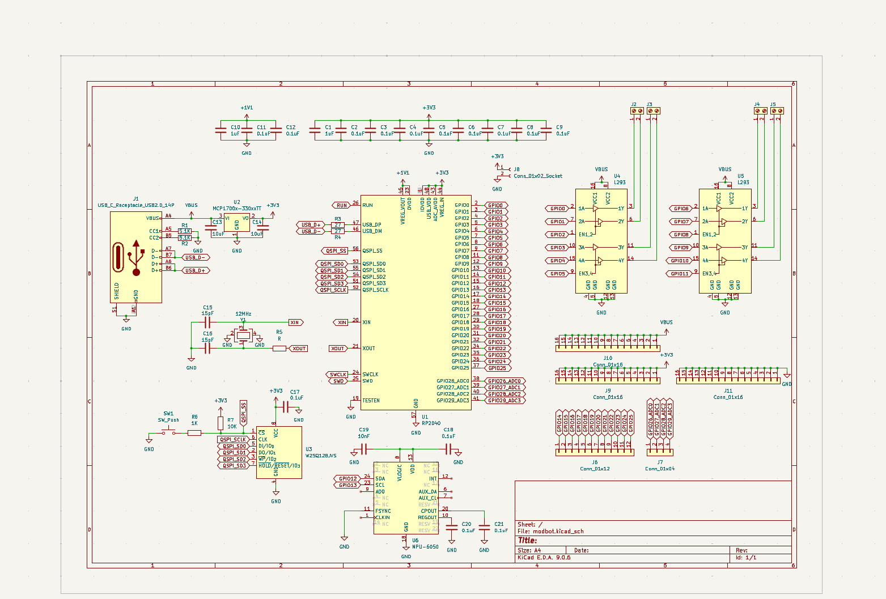
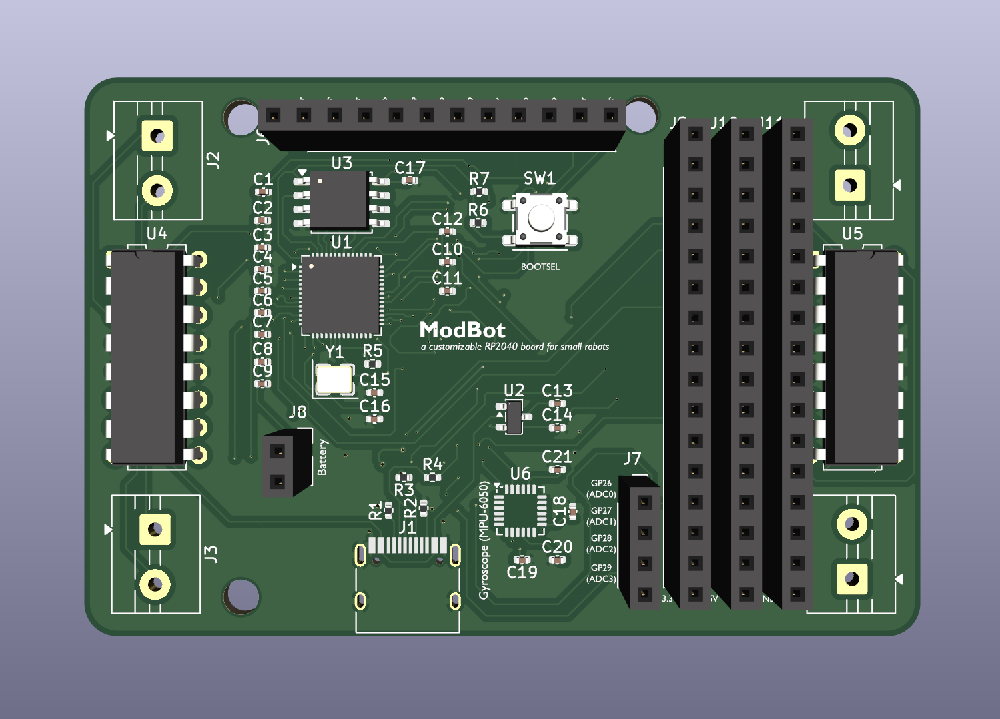

# ModBot

ModBot is a versatile RP2040 development board/robot base for mini robots. It is relatively small (~80x50mm), but packs a punch.

# Features

- RP2040 chip
- 2 L293D IC motor drivers (capable of driving 4 motors)
- MPU-6050 gyroscope + accelerometer IC
- 12 digital GPIO expansion pins 
- 4 ADC GPIO expansion pins
- 16 connections each for GND, +3.3V, and +5V (VBUS)
- Battery connection
- USB-C support (bare minimum for 2026)

# Pictures

|Schematic|PCB|
|---|---|
|||

# Notes

- If you are to use a battery with the board, you must include your own charging board and switch.
- I don't do FRC/FTC so I don't know if this would be something you can use for that.

---

Have fun!